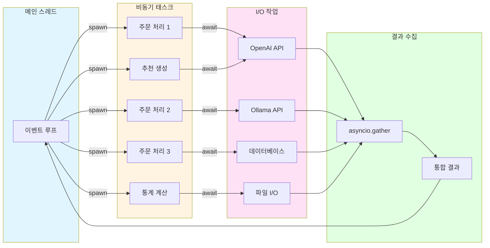

# 카페 키오스크 에이전트 - 아키텍처 Flowchart

## 1. 전체 시스템 아키텍처

## 2. 주문 처리 플로우

## 3. 멀티 라우터 시스템

## 4. 데이터 흐름

## 5. 에러 처리 플로우

## 6. 비동기 처리 구조

## 7. 모듈 의존성 그래프

## 8. 배치 주문 처리

## 범례

- 🟦 **파란색**: 사용자 인터페이스 / 입력
- 🟨 **노란색**: 에이전트 레이어 / 처리 과정
- 🟪 **보라색**: 라우터 레이어 / 분류
- 🟩 **초록색**: 서비스 레이어 / 비즈니스 로직
- 🟥 **빨간색**: 외부 서비스 / 에러
- 🟫 **회색**: 유틸리티 / 지원 기능
